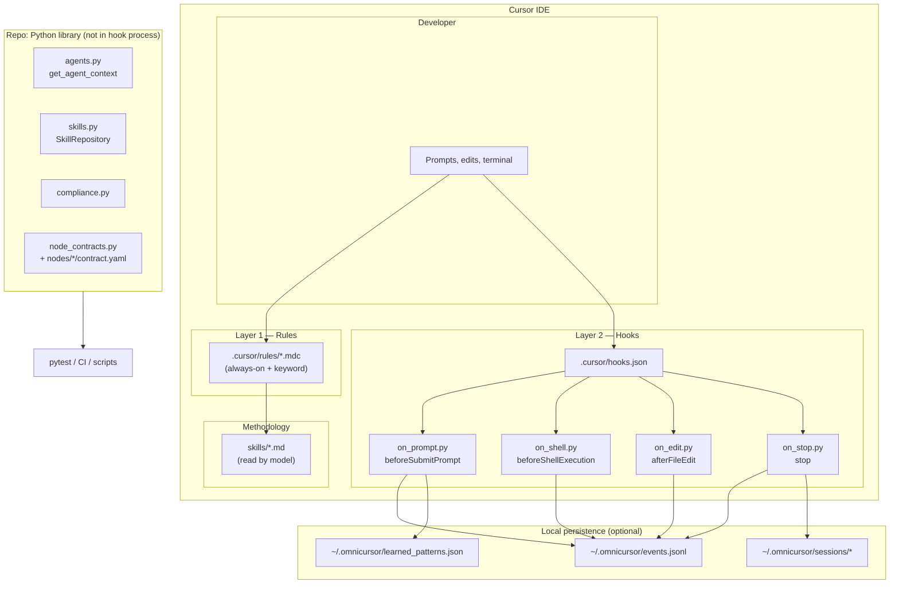
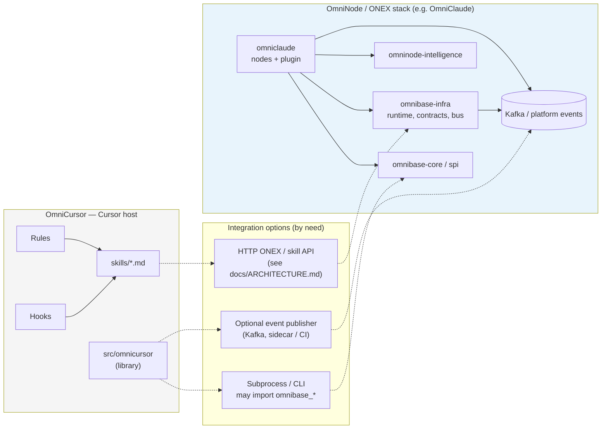

# OmniCursor — systems design

High-level architecture diagrams for OmniCursor and its optional relationship to the broader OmniNode stack (OmniClaude-style runtimes). Mermaid renders on GitHub and many other viewers.

---

## 1. OmniCursor — runtime layers (inside the IDE)

**Constraints:** Hook scripts under `.cursor/hooks/` use **stdlib only** and **must not** import `omnicursor`. The library under `src/omnicursor/` is for **tests**, **CI**, **optional CLIs**, or **subprocess** helpers invoked from outside the hook interpreter.

---

## 2. OmniCursor in the broader OmniNode ecosystem

Optional ways to align with OmniClaude / ONEX without running the full kernel inside Cursor:

Solid arrows: primary OmniCursor flows. Dotted arrows: **optional** integration paths.

---

## Related docs

- [`ADR-hook-first-architecture.md`](./ADR-hook-first-architecture.md) — rules vs hooks vs library
- [`OMNICURSOR_NODE_CONTRACTS.md`](./OMNICURSOR_NODE_CONTRACTS.md) — `contract.yaml` layout
- [`../ARCHITECTURE.md`](../ARCHITECTURE.md) — starter-pack buckets and frozen HTTP adapter
- [`../QUICKSTART.md`](../QUICKSTART.md) — setup and end-to-end usage
